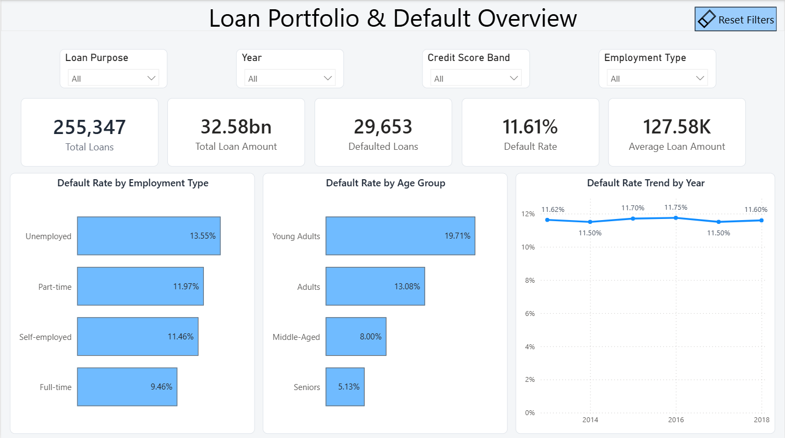
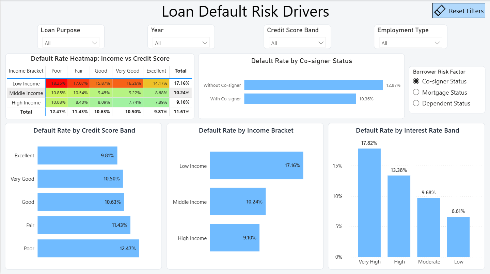
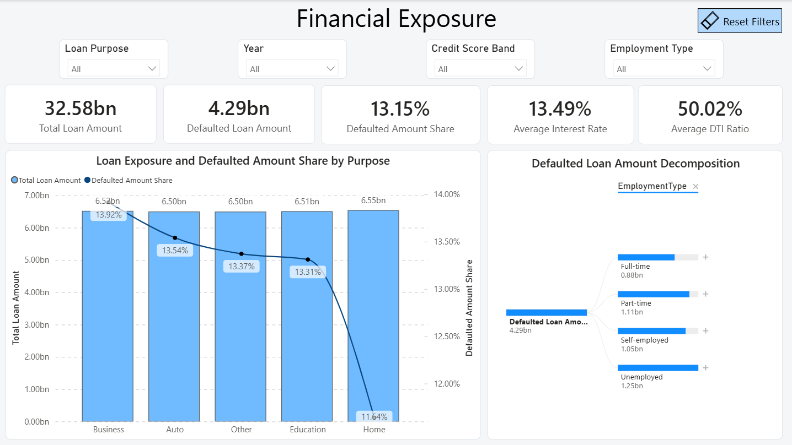
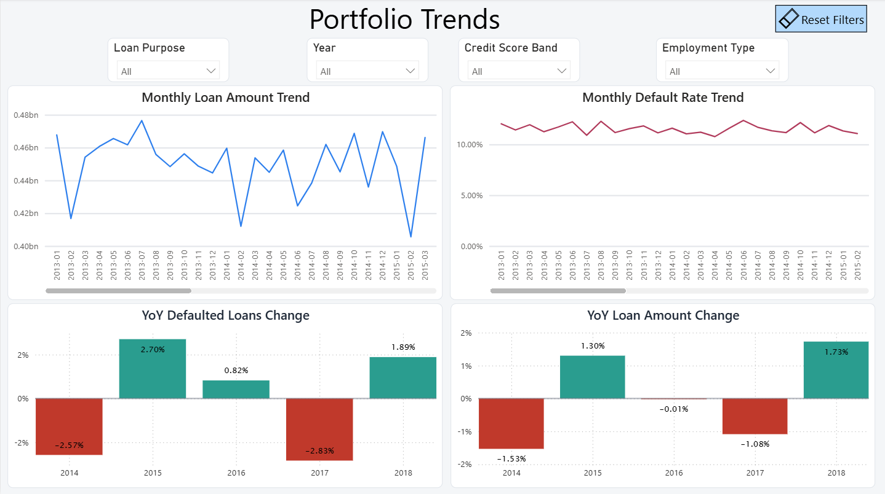
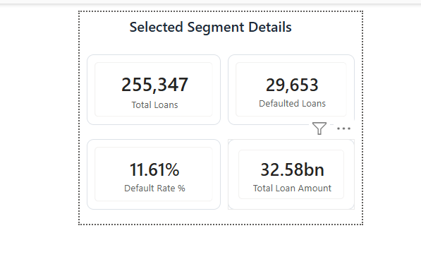

# Loan Default Risk Analysis

An end-to-end Power BI project analyzing a portfolio of **255,347 loans** to identify default-risk patterns, quantify defaulted exposure, and monitor portfolio performance over time.

The report moves from an executive portfolio summary to borrower risk drivers, financial exposure, monthly trends, and year-over-year performance.

## Business objectives

- Measure the size and quality of the loan portfolio.
- Identify borrower segments associated with higher default rates.
- Compare default frequency with the share of loan amount in default.
- Analyze financial exposure across different loan purposes.
- Monitor monthly and yearly portfolio trends.
- Provide an interactive dashboard for segment-level analysis.

## Headline results

| KPI | Result |
| --- | ---: |
| Total Loans | 255,347 |
| Total Loan Amount | 32.58bn |
| Defaulted Loans | 29,653 |
| Default Rate | 11.61% |
| Average Loan Amount | 127.58K |
| Defaulted Loan Amount | 4.29bn |
| Defaulted Amount Share | 13.15% |
| Average Interest Rate | 13.49% |
| Average DTI Ratio | 50.02% |

## Dashboard pages

### 1. Executive Overview

Provides a high-level summary of portfolio size, default performance, borrower employment risk, age-group risk, and annual default-rate trends.



### 2. Default Risk Drivers

Analyzes default rates across credit score, income, interest-rate and borrower-status segments.

The Borrower Risk Factor field parameter allows users to switch dynamically between:

- Co-signer Status
- Mortgage Status
- Dependent Status



### 3. Financial Exposure

Compares total loan exposure with defaulted amount share by loan purpose. The decomposition tree allows users to investigate defaulted loan exposure through different borrower characteristics.



### 4. Portfolio Trends

Tracks:

- Monthly Loan Amount
- Monthly Default Rate
- YoY Loan Amount Change
- YoY Defaulted Loans Change



## Interactive tooltip

A dedicated report-page tooltip displays contextual KPIs when users hover over a chart category:

- Total Loans
- Defaulted Loans
- Default Rate
- Total Loan Amount



## Key business insights

- **Young Adults** have the highest age-based default rate at **19.71%**.
- **Low Income** borrowers have a default rate of **17.16%**.
- Loans in the **Very High Interest Rate** band have a default rate of **17.82%**.
- **Unemployed** borrowers have the highest employment-based default rate at **13.55%**.
- **Poor Credit** borrowers default at **12.47%**, compared with **9.81%** for borrowers with excellent credit.
- Borrowers without a co-signer have a default rate of **12.87%**, compared with **10.36%** for borrowers with a co-signer.
- Borrowers without dependents have a default rate of **12.72%**, compared with **10.50%** for borrowers with dependents.
- Annual default rates remain between approximately **11.50% and 11.75%**, indicating persistent portfolio risk rather than a one-year spike.
- Defaulted Amount Share is **13.15%**, higher than the loan-count Default Rate of **11.61%**. This indicates that defaulted loans tend to carry larger amounts than the portfolio average.
- Home loans have the lowest Defaulted Amount Share among loan purposes at **11.64%**.

## Power BI features implemented

- Power Query data cleaning
- Dedicated Date table
- Active one-to-many relationship
- Centralized measure table
- Measure display folders
- DAX measures and calculated columns
- YTD and YoY time intelligence
- Monthly portfolio analysis
- Field parameters
- Dynamic visual titles
- Report-page tooltips
- Synced slicers
- Bookmark-based Reset Filters buttons
- Conditional formatting
- Positive and negative YoY colors
- Heatmap matrix
- Secondary Y-axis combination chart
- Decomposition tree

## Data model

The semantic model contains:

- `Loan_default` — loan-level fact table
- `Date Table` — dedicated calendar table
- `_Measures` — centralized measure table
- `Borrower Risk Factor` — disconnected field-parameter table

The active relationship is:

```text
Date Table[Date]  1 ──────── *  Loan_default[Loan Date]
```

Cross-filter direction is single from the Date table to the loan fact table.

The Date table covers:

```text
01 January 2013 to 31 December 2018
```

## Data preparation

- Verified 255,347 loan records.
- Checked for missing values and duplicate rows.
- Assigned appropriate date, numeric, text, and logical data types.
- Converted mortgage, dependent, co-signer, and default indicators to Boolean values.
- Created age, credit-score, income and interest-rate bands.
- Added numerical sort columns for ordered categories.
- Created and marked a dedicated Date table.
- Removed the redundant fact-table Year column.
- Hid technical sorting fields and raw Boolean columns.
- Organized measures into business-friendly display folders.

Detailed documentation is available in:

- [DAX Measures](documentation/DAX_Measures.md)
- [Data Dictionary](documentation/Data_Dictionary.md)
- [Data Preparation](documentation/Data_Preparation.md)

## Tools used

- Power BI Desktop
- Power Query
- DAX
- Microsoft Excel

## Repository structure

```text
Loan-Default-Risk-Analysis/
├── README.md
├── dashboard/
│   └── Loan_Default_Risk_Analysis.pbix
├── data/
│   └── Loan_Default_Dataset.xlsx
├── documentation/
│   ├── DAX_Measures.md
│   ├── Data_Dictionary.md
│   └── Data_Preparation.md
└── screenshots/
    ├── 01_executive_overview.png
    ├── 02_default_risk_drivers.png
    ├── 03_financial_exposure.png
    ├── 04_portfolio_trends.png
    └── 05_interactive_tooltip.png
```

## How to use the project

1. Download or clone this repository.
2. Open `dashboard/Loan_Default_Risk_Analysis.pbix` in Power BI Desktop.
3. If prompted, update the source path to `data/Loan_Default_Dataset.xlsx`.
4. Refresh the Power BI model.
5. Use the slicers, borrower-risk selector, tooltips, and decomposition tree to explore the portfolio.

## Interpretation note

`Defaulted Loan Amount` represents the loan amount associated with defaulted records.

It should be interpreted as **defaulted exposure**, not realized financial loss, because the dataset does not contain recovery or loss-given-default information.

## Author

**Aditya Ranjan**

Data Analyst | Power BI | SQL | Excel | Python
